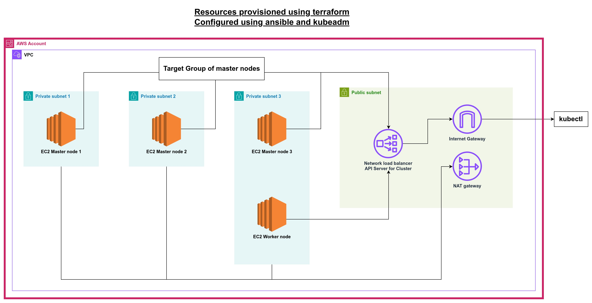

# Terraform and Ansible: Kubernetes Cluster Deployment with EC2 Instances

This Terraform code provisions an AWS infrastructure for a Kubernetes (K8s) cluster with three EC2 master nodes and worker nodes. Using the Ansible provider, it configures the nodes via `kubeadm` commands.

# Architecture 



## Resources Created

- **VPC**: A Virtual Private Cloud with 3 public and 3 private subnets for EC2 instances.
- **NAT Gateway**: A single NAT Gateway to enable outbound internet access for instances in private subnets.
- **Security Groups**: Security groups to manage access for the load balancer and Kubernetes nodes.
- **Key Pair**: A key pair generated for SSH access to the EC2 nodes.
- **Network Load Balancer (NLB)**: A load balancer to distribute traffic among master nodes.
- **Target Group**: A target group that manages master nodes for the load balancer.
- **Ansible Hosts**: Defined groups for master and worker nodes, used by the Ansible playbook for configuration.

## SSH Access to Private Instances via Bastion (Jumpbox)

To securely access private EC2 instances, you can connect via a public bastion host (jumpbox). Use the following SSH command:

```bash
ssh -i private-key.pem -o ProxyCommand="ssh -i private-key.pem -W %h:%p ubuntu@<bastion_public_ip>" ubuntu@<private_ip>
```

- Replace `private-key.pem` with your SSH key file.
- `<bastion_public_ip>`: Public IP address of the bastion host.
- `<private_ip>`: Private IP address of the target instance inside the private subnet.

## Adding a New Master Node

To scale your cluster by adding a new master node, follow these steps:

1. **Provision a new EC2 instance** for the additional master node.
2. **Update the Ansible hosts file**: Modify the `null_resource.update_hosts` to include the new master's private IP.
3. **Add the new master to the load balancer**: Update the `aws_lb_target_group_attachment` to register the new master in the target group.
4. **Update `ansible.tf`**: Add the new master's IP to the Ansible hosts for configuration.
5. **Output the private IP**: Add a new output in your Terraform code to display the private IP of the new master node.

Once these changes are applied, run the following command to provision the updated infrastructure:

```bash
terraform apply
```

Terraform will automatically update the load balancer and Ansible will configure the new master node.

## Removing a Master Node

Before deleting a master node from the Terraform configuration, you must gracefully remove it from the Kubernetes cluster to avoid disruption:

1. **Drain the master node**: This command safely evicts the workloads from the node.
   
   ```bash
   kubectl drain master3 --ignore-daemonsets
   ```

2. **Delete the node**: Once drained, remove the node from the cluster.
   
   ```bash
   kubectl delete node master3
   ```

3. **Update Terraform configuration**: Remove the EC2 instance and associated resources for the master node from the Terraform configuration.
4. **Run Terraform apply**: Execute the following to remove the node from your infrastructure:

   ```bash
   terraform apply
   ```

This ensures the master node is properly removed from both the cluster and the underlying infrastructure.

## Conclusion

This Terraform configuration, combined with Ansible for automation, provides an easy way to manage your Kubernetes infrastructure on AWS, allowing you to scale your cluster up or down as needed.