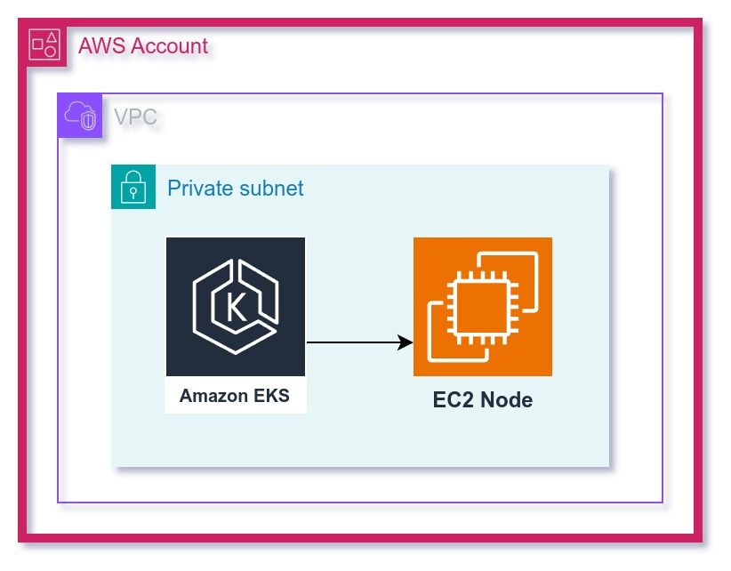

# Terraform VPC and EKS Module Setup

This Terraform configuration sets up an AWS Virtual Private Cloud (VPC) and Elastic Kubernetes Service (EKS) cluster using two separate modules: `vpc` and `eks`. The VPC module provisions a VPC with subnets, and the EKS module deploys a Kubernetes cluster in the provisioned VPC.

# Architecture 



## Prerequisites

- **Terraform**: Ensure that Terraform is installed on your machine. You can download it from [Terraform Downloads](https://www.terraform.io/downloads).
- **AWS Credentials**: Your AWS credentials should be configured in `~/.aws/credentials` or exported as environment variables.

## Usage

1. Clone this repository to your local machine.
2. Make sure your AWS credentials are set up and your AWS region is `us-east-1`.
3. Modify any variables in the configuration as needed.
4. Run the following commands:

```bash
terraform init     # Initialize the project
terraform plan     # Preview the infrastructure changes
terraform apply    # Apply the infrastructure changes
```

## Modules

### VPC Module

This module sets up the networking infrastructure, including VPC, subnets, internet gateway, and NAT gateways.

**VPC Module Configuration:**
```hcl
module "vpc" {
    source     = "./modules/vpc/"
    cidr_block = "10.0.0.0/16"
    namespace  = "tixr"
    stage      = "dev"
    region     = "us-east-1"
}
```

- **CIDR Block**: `10.0.0.0/16`
- **Namespace**: `tixr`
- **Stage**: `dev`
- **Region**: `us-east-1`

This module internally uses the `cloudposse/vpc/aws` module to create a VPC and the necessary subnets.

### EKS Module

The EKS module provisions an Amazon EKS cluster along with managed node groups and a Fargate profile.

**EKS Module Configuration:**
```hcl
module "eks" {
    source                 = "./modules/eks"
    vpc_cidr               = "10.0.0.0/16"
    vpc_id                 = module.vpc.vpc_id
    max_size               = 3
    min_size               = 1
    desired_size           = 1
    instance_types         = ["t3.small"]
    region                 = "us-east-1"
    private_subnet_ids      = module.vpc.private_subnet_ids
    security_group_ids      = module.vpc.vpc_default_security_group_id
    kubernetes_namespace    = "fargate-namespace"
    map_additional_iam_roles = [
        {
            userarn  = "arn:aws:iam::895884664845:user/vvats",
            username = "vvats",
            groups   = ["system:masters"]
        }
    ]
}
```

- **VPC CIDR**: The same CIDR block as the VPC.
- **Instance Types**: `t3.small` for worker nodes.
- **Kubernetes Namespace**: `fargate-namespace`
- **IAM Role Mapping**: Maps the IAM user to the `system:masters` Kubernetes group for administrative access.

This module uses `cloudposse/eks-cluster/aws` and `cloudposse/eks-node-group/aws` internally to create the EKS cluster and node groups.

### Submodules Used

- `cloudposse/vpc/aws`: For VPC creation.
- `cloudposse/dynamic-subnets/aws`: For managing subnets.
- `cloudposse/eks-cluster/aws`: For EKS cluster creation.
- `cloudposse/eks-node-group/aws`: For creating EKS node groups.
- `cloudposse/eks-fargate-profile/aws`: For creating Fargate profiles.

## Variables

- **vpc_cidr**: CIDR block for the VPC (default: `10.0.0.0/16`).
- **instance_types**: Instance types for the EKS worker nodes (default: `["t3.small"]`).
- **region**: AWS region (default: `us-east-1`).
- **desired_size**: Desired number of EKS nodes.
- **max_size**: Maximum number of EKS nodes.
- **min_size**: Minimum number of EKS nodes.

## Outputs

After running `terraform apply`, the following outputs are available:

- **VPC ID**: The ID of the created VPC.
- **Private Subnet IDs**: List of private subnets created in the VPC.
- **EKS Cluster Name**: Name of the EKS cluster.
- **EKS Node Group ARN**: ARN of the EKS node group.

## Clean-Up

To delete the infrastructure created by this configuration, run:

```bash
terraform destroy
```

This will remove all AWS resources created by Terraform.
